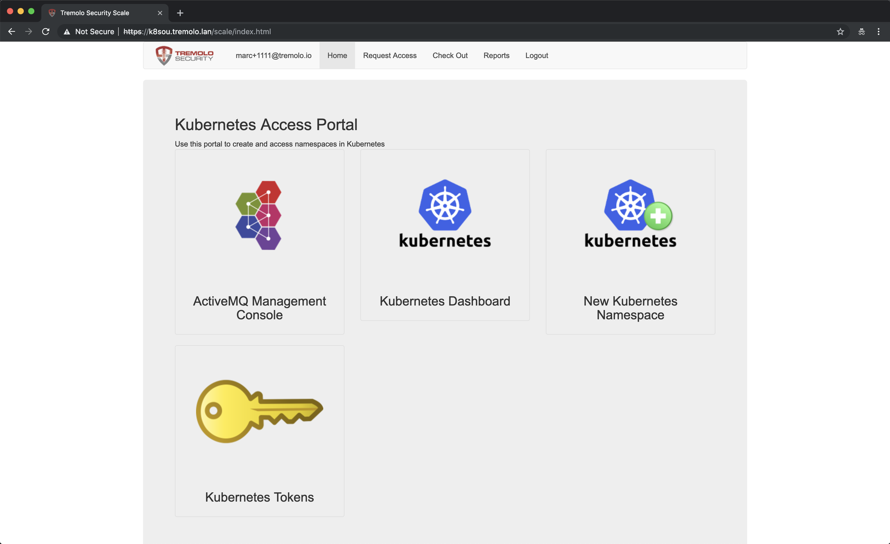
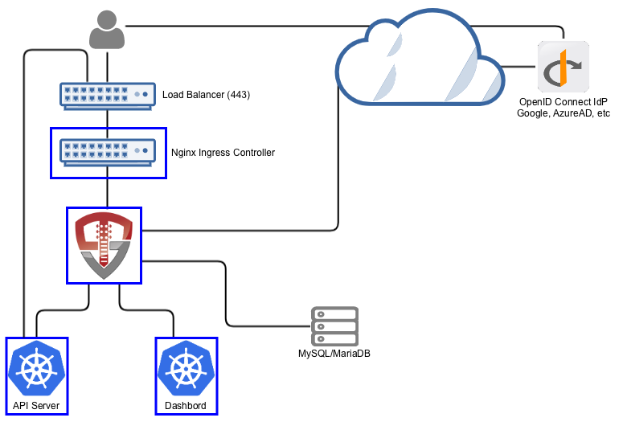

# Orchestra For Kubernetes - OpenID Connect

Orchestra is an automation portal for Kubernetes built on OpenUnison.  Orchestra integrates a user's identity into Kubernetes enabling:

1. SSO between the API server and your LDAP infrastructure
2. SSO with the Kubernetes Dashboard
3. Self service access to existing Namespaces
4. Self service creation of new Namespaces
5. Workflows for automating access approvals without getting system administrators involved
6. Built in self service reporting





When a user accesses Kubernetes using Orchestra, they'll access both the self service portal and the dashboard through OpenUnison's reverse proxy (instead of directly via an ingress).  OpenUnison will inject the user's identity into each request, allowing the dashboard to act on their behalf.

Orchestra stores all Kubernetes access information as a groups inside of a relational database, as opposed to a group in an external directory.  OpenUnison will create the appropriate Roles and RoleBindings to allow for the access.



# Roles Supported

## Cluster

1.  Administration - Full cluster management access

## Namespace

1.  Administrators - All operations inside of a namespace
2.  Viewers - Can view contents of a namespace (except `Secret`s), but can not make changes

## Non-Kubernetes

1.  System Approver - Able to approve access to roles specific to OpenUnison
2.  Auditor - Able to view audit reports, but not request projects or approve access

# Deployment

## What You Need To Start

Prior to deploying OpenUnison you will need:

1. Kubernetes 1.10 or higher
2. The Nginx Ingress Controller deployed (https://kubernetes.github.io/ingress-nginx/deploy/)
3. A MySQL or MariaDB Database
4. Information from your OpenID Connect Identity Provider per "Create Environments File" in the next section.  When registering OpenUnison with your identity provider, use the hostname and `/auth/oidc` as the redirect.  For instance if OpenUnison will be running on `k8sou.tremolo.lan.com` then the redirect_uri will be `https://k8sou.tremolo.lan/auth/oidc`
5. An SMTP server for sending notifications
6. Deploy the dashboard to your cluster

This installer will create the `openunison` namespace, create certificates for you (including for the dashboard) and the approprioate `CronJob` needed to make sure that certificates are kept updated.

### Required Attributes for Your Identity Provider

In order to integrate your identity provide make sure the following attributes are in the `id_token`:

* sub
* email
* given_name
* family_name
* name

These are then mapped into the user's object in OpenUnison for personalization.  

## Create Environments File

Orchestra is driven by a Kubernetes Custom Resource that stores configuration properties.  Secret properties are stored in a source secret.  The deployment tool will create the correct objects for you.  You'll need to create two properties files, one for secret information (such as passwords) and one for non-secret data.  First create a directory for non secret data, ie `/path/to/orchestra-configmaps` and create a file called `input.props` with the below content customized for your environment:

```properties
OU_HOST=k8sou.tremolo.lan
K8S_DASHBOARD_HOST=k8sdb.tremolo.lan
K8S_URL=https://k8s-installer-master.tremolo.lan:6443
OU_HIBERNATE_DIALECT=org.hibernate.dialect.MySQL5InnoDBDialect
OU_QUARTZ_DIALECT=org.quartz.impl.jdbcjobstore.StdJDBCDelegate
OU_JDBC_DRIVER=com.mysql.jdbc.Driver
OU_JDBC_URL=jdbc:mysql://dbs.tremolo.lan:3308/unison
OU_JDBC_USER=root
OU_JDBC_VALIDATION=SELECT 1
SMTP_HOST=smtp.gmail.com
SMTP_PORT=587
SMTP_USER=donotreply@domain.com
SMTP_FROM=donotreply@domain.com
SMTP_TLS=true
OU_CERT_OU=k8s
OU_CERT_O=Tremolo Security
OU_CERT_L=Alexandria
OU_CERT_ST=Virginia
OU_CERT_C=US
USE_K8S_CM=true
SESSION_INACTIVITY_TIMEOUT_SECONDS=900
OIDC_CLIENT_ID=my_idp_client_id
OIDC_IDP_AUTH_URL=https://accounts.google.com/o/oauth2/v2/auth
OIDC_IDP_TOKEN_URL=https://oauth2.googleapis.com/token
OIDC_IDP_LIMIT_DOMAIN=tremolosecurity-test.com
```

Also, place any certificates you want Orchestra to trust, such as the certificate for your identity provider, in PEM format in `/path/to/orchestra-configmaps`.  Any certificates stored as PEM files will be trusted by Orchestra.

Next create a directory for secret information, such as `/path/to/orchestra-secrets` with a file called `input.props` with at least the below information:

```
OU_JDBC_PASSWORD=start123
SMTP_PASSWORD=xxxx
unisonKeystorePassword=start123
OIDC_CLIENT_SECRET=SOME_SECRET
```

*Detailed Description of Non-Secret Properties*

| Property | Description |
| -------- | ----------- |
| OU_HOST  | The host name for OpenUnison.  This is what user's will put into their browser to login to Kubernetes |
| K8S_DASHBOARD_HOST | The host name for the dashboard.  This is what users will put into the browser to access to the dashboard. **NOTE:** `OU_HOST` and `K8S_DASHBOARD_HOST` **MUST** share the same DNS suffix. Both `OU_HOST` and `K8S_DASHBOARD_HOST` **MUST** point to OpenUnison |
| K8S_URL | The URL for the Kubernetes API server |
| OU_HIBERNATE_DIALECT | Hibernate dialect for accessing the database.  Unless customizing for a different database do not change |
| OU_QUARTZ_DIALECT | Dialect used by the Quartz Scheduler.  Unless customizing for a different database do not change  |
| OU_JDBC_DRIVER | JDBC driver for accessing the database.  Unless customizing for a different database do not change |
| OU_JDBC_URL | The URL for accessing the database |
| OU_JDBC_USER | The user for accessing the database |
| OU_JDBC_VALIDATION | A query for validating database connections/ Unless customizing for a different database do not change |
| SMTP_HOST | Host for an email server to send notifications |
| SMTP_PORT | Port for an email server to send notifications |
| SMTP_USER | Username for accessing the SMTP server (may be blank) |
| SMTP_FROM | The email address that messages from OpenUnison are addressed from |
| SMTP_TLS | true or false, depending if SMTP should use start tls |
| OU_CERT_OU | The `OU` attribute for the forward facing certificate |
| OU_CERT_O | The `O` attribute for the forward facing certificate |
| OU_CERT_L | The `L` attribute for the forward facing certificate |
| OU_CERT_ST | The `ST` attribute for the forward facing certificate |
| OU_CERT_C | The `C` attribute for the forward facing certificate |
| USE_K8S_CM | Tells the deployment system if you should use k8s' built in certificate manager.  If your distribution doesn't support this (such as Canonical and Rancher), set this to false |
| SESSION_INACTIVITY_TIMEOUT_SECONDS | The number of seconds of inactivity before the session is terminated, also the length of the refresh token's session |
| OIDC_CLIENT_ID | The client ID registered with your identity provider |
| OIDC_IDP_AUTH_URL | Your identity provider's authorization url |
| OIDC_IDP_TOKEN_URL | Your identity provider's token url |
| OIDC_IDP_LIMIT_DOMAIN | An email domain to limit access to |
| K8S_DASHBOARD_NAMESPACE | **Optional** If specified, the namespace for the dashboard.  For the 1.x dashboard this is `kube-system`, for the 2.x dashboard this is `kubernetes-dashboard` |
| K8S_CLUSTER_NAME | **Optional** If specified, the name of the cluster to use in the `./kube-config`.  Defaults to `kubernetes` |

*Detailed Description of Secret Properties*

| Property | Description |
| -------- | ----------- |
| OU_JDBC_PASSWORD | The password for accessing the database |
| SMTP_PASSWORD | Password for accessing the SMTP server (may be blank) |
| unisonKeystorePassword | The password for OpenUnison's keystore |
| OIDC_CLIENT_SECRET | The secret provided by your identity provider |

Based on where you put the files from `Prepare Deployment`, run the following:

```
curl https://raw.githubusercontent.com/TremoloSecurity/kubernetes-artifact-deployment/master/src/main/bash/deploy_openunison.sh | bash -s /path/to/configmaps /path/to/secrets https://raw.githubusercontent.com/OpenUnison/openunison-k8s-idm-oidc/master/src/main/yaml/artifact-deployment.yaml
```

The output will look like:

```
namespace/openunison-deploy created
configmap/extracerts created
secret/input created
clusterrolebinding.rbac.authorization.k8s.io/artifact-deployment created
job.batch/artifact-deployment created
NAME                        READY     STATUS    RESTARTS   AGE
artifact-deployment-jzmnr   0/1       Pending   0          0s
artifact-deployment-jzmnr   0/1       Pending   0         0s
artifact-deployment-jzmnr   0/1       ContainerCreating   0         0s
artifact-deployment-jzmnr   1/1       Running   0         4s
artifact-deployment-jzmnr   0/1       Completed   0         15s
```

Once you see `Completed`, you can exit the script (`Ctl+C`).  This script will import the OpenUnison operator, create the appropriate Custom Resource Definitions and finally deploy a custom resource based on your configuration.  Once the custom resource is deployed the OpenUnison operator will deploy Orchestra for you. 

## Complete SSO Integration with Kubernetes

Run `kubectl describe configmap api-server-config -n openunison` to get the SSO integration artifacts.  The output will give you both the API server flags that need to be configured on your API servers.  The certificate that needs to be trusted is in the `ou-tls-certificate` secret in the `openunison` namespace.

## First Login to Orchestra

At this point you should be able to login to OpenUnison using the host specified in  the `OU_HOST` of your properties.  Once you are logged in, logout.  Users are created in the database "just-in-time", meaning that once you login the data representing your user is created inside of the database deployed for Orchestra.

## Create First Administrator

The user you logged in as is currently unprivileged.  In order for other users to login and begin requesting access to projects this first user must be enabled as an approver.  Login to the MySQL database deployed for Orchestra and execute the following SQL:

```sql
insert into userGroups (userId,groupId) values (2,1);
```

This will add the administrator group to your user.  Logout of Orchestra and log back in.

## Self Request & Approve Cluster Administrator

Once SSO is enabled in the next step, you'll need a cluster administrator to be able to perform cluster level operations:

1.  Login to Orchestra
2.  Click on "Request Access" in the title bar
3.  Click on "Kubernetes Administration"
4.  Click "Add To Cart" next to "Cluster Administrator"
5.  Next to "Check Out" in the title bar you'll see a red `1`, click on "Check Out"
6.  For "Supply Reason", give a reason like "Initial user" and click "Submit Request"
7.  Since you are the only approver refresh OpenUnison, you will see a red `1` next to "Open Approvals".  Click on "Open Approvals"
8. Click "Review" next to your email address
9. Specify "Initial user" for the "Justification" and click "Approve"
10. Click on "Confirm Approval"

At this point you will be provisioned to the `k8s-cluster-administrators` group in the database that has a RoleBinding to the `cluster-admin` Role.  Logout of Orchestra and log back in.  If you click on your email address in the upper left, you'll see that you have the Role `k8s-cluster-administrators`.  

# Updating Secrets and Certificates

To update any of the secrets in the source secret:

1. Update the `orchestra-secrets-source` secret in the `openunison` namespace as appropriate
2. Add an annotation (or edit an existing one) on the `orchestra` `openunison` object in the `openunison` namespace

This will trigger the operator to update your OpenUnison pods.  To update certificates or non-secret data, just update it in the `orchestra` `openunison` object.

# Customizing Orchestra

Orchestra is an application built on OpenUnison with several "opinions" on how you should manage authentication in your cluster.  These opinions my be close to what you need, but not exact.  In order to customize Orchestra you'll need:

1. git
2. OpenJDK 8
3. Apache Maven
4. Docker registry

First, fork this GitHub project.  Then make your edits.  To deploy to a local Docker daemon that you want to then use to push to a registry:

```
mvn clean package
mvn compile jib:dockerBuild
docker tag image:version registry/image:version
docker push registry/image:version
```

If you have credentials to access a registry remotely and are not running docker locally, you can push the image directly to your registry:

```
mvn clean package
export OU_CONTAINER_DEST=registry/image:version
export OU_REG_USER=registry_user
export OU_REG_PASSWORD=registry_password
mvn compile jib:build
```

# Whats next?
Users can now login to create namespaces, request access to cluster admin or request access to other clusters.

Now you can begin mapping OpenUnison's capabilities to your business and compliance needs.  For instance you can add multi-factor authentication with TOTP or U2F, Create privileged workflows for onboarding, scheduled workflows that will deprovision users, etc.
